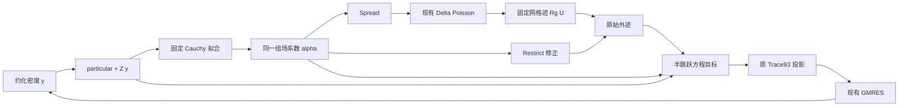

# Shared correction field KFBI

本实现把共享修正场接入 `kfbi_trace93_study_3d`。原默认后端仍为 `direct_cauchy`；
`shared_field` 是显式启用的实验后端，当前支持 U 柱、Laplace、Dirichlet/Neumann。
本地验证记录见 [验证报告](Shared_Field_KFBI_Validation.md)，完整推导见
[设计说明](superpowers/specs/2026-09-12-shared-correction-field-design.md)。

## 两个空间和一个求解流程

原密度仍使用 `Trace93DensityLayout3D` 的 analysis 参数样条，迭代量满足
`c = particular + Z*y`。几何约束、Polar-Star 子空间、Neumann mean gauge 及
edge/vertex 投影没有由体样条替换。

独立的体样条场 `D = sum(alpha_j B_j)` 位于物体参考坐标系的边界窄带。
不同面的条件共同确定同一个 `alpha`。它是三次张量积、跨普通结点面 C² 的样条，
并非 C³，也不是按每个面分别生成再拼接的多项式。



公共 `solve_affine_kfbi_3d` 只负责基场、齐次 matvec 和最终恢复。它不获得制造解
回调，也不选择修正面。两个后端使用相同的 Poisson、坐标和外层求解流程。

## 模块职责

| 模块 | 职责 |
| --- | --- |
| `support/correction/shared_field_geometry_3d` | U 柱的参考矩形、刚体变换、H 切分后的曲面积分 |
| `support/correction/shared_field_space_3d` | 活动体单元、共享格点编号、64 点支撑、解析导数、体求积 |
| `support/correction/shared_field_extension_3d` | 固定加权最小二乘、三次多项式 lift、列缩放、LDLT 分解与两次改进 |
| `support/trace/shared_field_transfer_3d` | Spread/Restrict 网格查询并集、固定 S/J/Rg 和负法向点评价 |
| `support/correction/shared_field_backend_3d` | 原密度采样、规定数据、一次拟合和一次共享传递、requested/fitted jump、快照 |
| `support/trace/kfbi_correction_backend_3d` | 统一接口及旧 Resource 矩阵适配器 |
| `support/trace/affine_trace_coordinates_3d` | 原 `Z`、特解和含 edge/vertex 项的投影 |
| `support/trace/jump_identity_closure_3d` | 从 raw trace 生成 equation target，不改 U |
| `support/solver/affine_kfbi_solve_3d` | 两种后端共用的仿射 KFBI 外层流程 |

路径均相对 `src/`。公共模块编入 `kfbim_3d_app_geometry`；共享场数值模块和
`shared_field_transfer_3d` 编入实验库 `kfbim_3d_shared_correction`。
公共库不反向依赖实验库，所有这些支撑接口均不安装为公开 API。

## 窄带和连续性

默认 `H=4h`、带宽 `W=4h`。参考坐标整数单元中心到所有有限矩形的最小距离满足
`distance <= W + sqrt(3)*H/2` 时，该单元被激活。每个活动单元收集
`{-1,0,1,2}^3` 的 64 个支撑格点，全局排序去重后编号。

基函数编号与面无关，重叠支撑天然使用同一系数，因此连续性由整个体样条空间
保证。带外没有隐含的零边界条件。所有 S/R 网格点、负法向采样点和界面迹点
在固定拟合分解前检查支撑；覆盖不足直接报错。

## 固定 Cauchy 拟合

面上对值 jump、法向 jump 分别做软拟合，体内对 Laplacian 做软拟合。
面/体权重各自归一化，法向项乘 h，PDE 项乘 h²。
三种权重、列缩放、正则参数和多项式 lift 的映射在初始化时固定；
每次评价的 lift 系数随本次值 jump 线性更新。

lift 只由界面值数据的 20 项三次多项式最小二乘得到。正则化惩罚围绕 lift，
不能等价替换成对整个场系数向量的零中心惩罚。稀疏正规矩阵只做一次
`Eigen::SimplicialLDLT`/AMD 分解；每次输入密度按相同次序求解并做两次残差改进。
不形成稠密的“密度到全网格”映射。

规定数据仅在 setup 采样。`Homogeneous` 不加规定数据；`WithPrescribedData`
只增加固定已知项。值、法向和 PDE 拟合残差分别输出；这些是软条件，不能把
“能解最小二乘”理解为逐点满足所有界面条件。

## 共享 Spread 和 Restrict

Spread 只依赖网格标签变化。使用 inside-minus-outside jump，而现有 Poisson
解的是 Delta，节点 i 的右端项为 `(chi_j-chi_i)*D(x_j)/h²`。
后端已经返回 `rhs_for_delta`；公共求解流程不能再取一次负号。

Restrict 复用现有两侧 Q27（Neumann）或 Q64（Dirichlet）cover，沿法向的六点为
`(-1.5,-.75,-.5,.5,.75,1.5)*h`，用固定三次伪逆恢复值和导数。
Spread 与 Restrict 对网格值的请求先合并，每次 forward 只评价一次这些点。

默认 `staged` 先修正到各侧共同场，再从负法向采样扣除同一个 D；`direct`
用 `-chi*D` 直接修正。两者都使用同一场系数。网格观察算子 Rg 是固定矩阵，
与最近一次拟合无关。

原生 NURBS 网格标签和完整事件认证仍保留，且与解析 U 柱标签逐点核对。
共享场不建立旧后端的 owner/support-path 规划，不是几何认证失败的回退路线。

## 原始外迹与方程目标

`raw_trace = Rg*U + raw_correction` 保留实际恢复的外迹。
`requested_jump` 是原密度与规定数据在外层迹点的值；`fitted_jump` 来自同一次 alpha。

面内迹点的 `input_jump_half` 使用：

```text
equation_value  = raw_value  + 0.5*(fitted_value_jump  - requested_value_jump)
equation_normal = raw_normal + 0.5*(fitted_normal_jump - requested_normal_jump)
```

GMRES 和最终真实投影残差使用 equation target。内解误差从 U 独立计算，不能
从 equation residual 推断。半跳跃系数只用于当前面内 Gauss 点，不推广到边角点。

每次评价有实例内递增 ID。最终 forward 后立刻保存同 ID 的系数和诊断副本，
之后的谱探针或回放不改变最终快照；请求过期 ID 会报错。

## 构建和运行

沿用已经配置正确编译器、Eigen 和 CGAL 的本地 build 目录：

```powershell
cmake -S . -B build-3d -DKFBIM_BUILD_EXPERIMENTAL_3D=ON -DBUILD_TESTING=ON
cmake --build build-3d --config Release --target kfbi_trace93_study_3d --parallel 1 -- /p:PreferredToolArchitecture=x64 /nodeReuse:false
$env:PATH = 'D:/CGAL/CGAL-5.2-beta1/auxiliary/gmp/lib;' + $env:PATH
./build-3d/apps/Release/kfbi_trace93_study_3d.exe `
  --geometry u --N 32 --bvp both --transform rotate `
  --correction-backend shared_field --exterior-target input_jump_half `
  --verify-replay --output output/shared_field_example
```

以上构建参数适用于本机 Visual Studio；其他生成器去掉 `--` 后的 MSBuild 参数。
单配置生成器的程序在 `build-3d/apps/`。结果目录必须不存在。
本机运行前需要将 `D:/CGAL/CGAL-5.2-beta1/auxiliary/gmp/lib` 加到 PATH，
以加载当前 CGAL 使用的 GMP/MPFR DLL。
完整矩阵脚本及来源文件见 [测试目录](../tests/cases/shared_field_3d/README.md)。
矩阵 runner 使用 PowerShell 7（`pwsh`），不支持 Windows PowerShell 5.1。

| 选项 | 默认/含义 |
| --- | --- |
| `--correction-backend` | `direct_cauchy`；可选 `shared_field` |
| `--exterior-target` | 旧后端默认 `raw`；shared 显式启用后默认 `input_jump_half` |
| `--shared-field-ratio` / `--shared-field-width` | 4 / 4，单位为 h |
| `--shared-field-ridge` | 1e-12 |
| `--shared-field-value-weight` / `--shared-field-normal-weight` / `--shared-field-pde-weight` | 均为 1 |
| `--shared-field-restrict` | `staged`；另有诊断模式 `direct` |
| `--operator-spectrum` | N32 逐列组装约化矩阵、输出奇异值、Z 和条件数 |
| `--verify-replay` | 从保存的密度/约化/场系数及迹文件检查一次 forward 回放 |
| `--dump-grid` | 额外保存完整网格解 |

shared 不接受旧后端专属的 `--policy`、`--event-mode`、`--compare-cache`。
实验开关关闭时仍可构建旧入口，显式选择 shared 会提示尚未编译。

每次运行保存最终 density/reduced 系数及 raw/equation 完整迹；shared 另保存
场系数和 requested/fitted jump。JSON 含配置、原始及方程残差、拟合残差、
分解/查询规模、时间和独立物理误差。`field_solve_backward_residual` 使用真正
求解的 z 在转换回 alpha 前计算；`field_normalized_optimality` 是从保存的
alpha 独立重构后的最优性诊断，两者不应混为同一个舍入层次。

## 扩展边界

未来 L 柱或曲面需要三个明确接点：几何/窄带求积适配、原密度采样、成对的
lift/project。当前有限矩形距离和 H 切分面求积不能直接冒充曲面实现；曲面需
研究体样条结点面与曲面求积的交切。拓扑密度空间应调用自身质量坐标的
`lift_homogeneous_c0()` 和 `project()`，不能直接套用 Trace93 的 Z。

粗网格阶数、直接 raw 目标的病态性、N128 时间与内存均属于实测验证内容，
不由 C² 空间或半跳跃公式自动保证。生产默认切换仍需独立验证。
