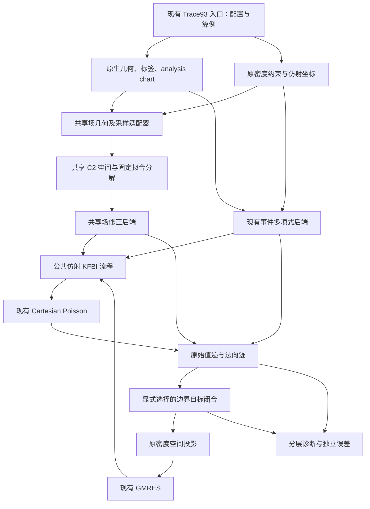

# 共享修正场 KFBI：算法说明与本地整体集成设计

日期：2026-09-12。本文件保留实施前的算法推导和整体设计。
后续用户已授权实现，C++ 后端及公共流程现已落地；当前类型、命令和实际验证以
[实现说明](../../Shared_Field_KFBI_Implementation.md) 与 [验证报告](../../Shared_Field_KFBI_Validation.md) 为准。

## 1. 依据、目标与设计决策

本地基点为 `12e3f0120448f833d5c02c5c6e16a7c249b11a79`，分支为 `codex/industrial-nurbs-models`；Trace93 核心来自 `80495520e53ea14c16bacd88d6be1aa310111c09`。

本次来源包是 `KFBI3D_UPrism_ActualKFBI_SharedField.zip`，SHA-256 为 `23cfa03489e1d1004a57f39703e1f4237d83afb6da096fed7cc7033ecb884ce5`。审阅副本位于仓库 `tmp/sharedfield_review_20260912_135041/KFBI3D_KFBI_SharedField/`。该目录仅为本次阅读副本，不作为未来构建或测试的运行依赖。

关键来源：包内 `src/shared_field_base.py`、`src/kfbi_shared.py`、`src/verify_shared.py`、`src/run_suite.py`、`REPORT.md`、`STATUS.json`。报告中的数字属于交付包记录，不代表本地 C++ 已完成验证。

用户要求是完整呈现算法，并设计它如何融入现有代码框架。选择以下架构：

> 统一仿射 KFBI 求解流程，保留现有密度/几何/投影；把交点多项式和共享修正场实现为两个可选择的修正后端。

考虑过的三种接入方式：

| 方式 | 影响 | 决定 |
| --- | --- | --- |
| 在公共求解流程下增加共享场后端 | 共用外层迭代、网格求解、诊断和密度；内层场求解保持因式结构 | 采用 |
| 把共享场包装成 `Trace93PolynomialCatalog3D` 的新中心策略 | 会把一次稀疏因子求解误装成逐交点稀疏系数行，可能形成稠密总映射 | 不采用 |
| 另建完整 Python/C++ 独立求解程序 | 快速演示，但重复几何、投影、GMRES 和输出语义 | 不采用 |

首期实现范围是：现有 `kfbi_trace93_study_3d` 入口，U 柱，Laplace，Dirichlet/Neumann，两种包内姿态，N32/64/128。接口要允许以后接入 L 柱、曲面和 topology 路线，但首期不把未验证的几何标成支持。

## 2. 必须区分的两套空间

### 2.1 原有密度空间

仍使用面上的三次 B 样条密度，以及原有相容条件：

\[
C c=d,\qquad c=c_p+Zy.
\]

Dirichlet 的仿射边条件、Neumann 的 Polar-Star 条件、均值规范、密度细化规则都保持当前 Trace93 语义。若存在固定约束缺陷 \(Cc_p-d\)，继续报告；共享场不负责偷偷消除或重定义该缺陷。

这里的 \(c\) 是界面密度系数，\(y\) 是外层 GMRES 坐标。

### 2.2 新增共享修正场空间

在体参考坐标 \(\xi=R^T(x-t)\) 下构造

\[
D_h(x)=\sum_j\alpha_j\,\mathcal B_j(R^T(x-t)).
\]

\(\mathcal B_j\) 是均匀三次张量积 cardinal B 样条。所有面、棱、顶点附近共用一套全局系数编号；每个普通评价点具有 64 个局部基函数支撑。

- 场定义于整个闭表面附近的活动单元并集；不是每张面或每个交点独立拟合一个多项式。
- 包内默认场间距 \(H=4h\)，名义窄带半宽 \(W=4h\)；活动单元和系数还包含支撑余量。
- 活动单元中心到矩形面并集的距离满足 \(d\le W+\sqrt3 H/2\) 时保留；首期保留包内参考坐标包围盒和格点原点，保证相同离散空间。
- 场是跨样条结点面的 \(C^2\) 空间，具有共同的值、梯度和 Hessian。一般不是 \(C^3\)，不能声称三阶 jump 全局连续。
- 它是分片张量 \(Q_3\) 样条，不是总次数三次的单个 \(P_3\) 多项式。
- \(\alpha\) 只属于内层拟合，不增加外层 GMRES 未知数。
- 窄带外边界不另加 `D_h=0` 条件；这是正则化 Cauchy 拟合空间的截取边界，与 Poisson 计算盒的零 Dirichlet 边界是两回事。

## 3. 每次算子作用的输入

统一采用内减外的跳跃约定：

\[
a=[u]=u_{\rm in}-u_{\rm out},\qquad
b=[\partial_nu]=\partial_nu_{\rm in}-\partial_nu_{\rm out},
\]

两侧导数都沿区域外法向 \(n\)。

| 边值问题 | 要求的值 jump \(a\) | 要求的法向 jump \(b\) | 活跃的外迹方程 |
| --- | --- | --- | --- |
| Neumann | 当前密度 \(\mu(c)\) | 已知 \(g_N\) | 外侧值迹 |
| Dirichlet | 已知 \(g_D\) | 当前密度 \(\mu(c)\) | 外侧法向迹 |

仿射基场输入 \(c_p\) 并包含已知边界数据。GMRES 增量输入 \(Zy\)，已知数据为零。最终恢复输入 \(c_p+Zy\)，已知数据加一次。

拟合采样点与外层迹点是两套观察点：

1. 拟合曲面积分在每张参考矩形面上按场格点线切分，每个子矩形使用 4×4 Gauss 点。
2. 窄带每个活动体单元使用 3×3×3 Gauss 点。
3. 外层迹点仍是原密度单元的 4×4 Gauss 点，不换成场采样点。
4. 在任一曲面采样点，密度值必须通过原始 analysis 参数和原密度基函数评价。

包内制造解只提供规定的边界数据；未知 jump 在内层来自当前密度。未知密度的精确值及场外精确值只能用于独立诊断。

## 4. 共享修正场的拟合：精确到离散矩阵

记场系数为 \(\alpha\)，曲面值评价矩阵为 \(T\)，外法向导数矩阵为 \(N\)，体单元 Laplacian 评价矩阵为 \(P\)。设曲面积分权重为 \(w_i\)，体积权重为 \(v_k\)：

\[
W_s=\operatorname{diag}\sqrt{w_i/\sum w_i},\qquad
W_v=\operatorname{diag}\sqrt{v_k/\sum v_k}.
\]

三项权重默认 \(\omega_a=\omega_b=\omega_p=1\)，构造

\[
M=\begin{bmatrix}
\sqrt{\omega_a}W_sT\\
\sqrt{\omega_b}hW_sN\\
\sqrt{\omega_p}h^2W_vP
\end{bmatrix},\qquad
q(a,b)=\begin{bmatrix}
\sqrt{\omega_a}W_sa\\
\sqrt{\omega_b}hW_sb\\
0
\end{bmatrix}.
\]

这是分别按总面积、总体积归一化的离散求积范数，不能直接描述为未经归一化的连续积分。体源项为零，因为来源方案的两侧辅助方程为 Laplace。

### 4.1 三次 lift 与正则化

先仅用曲面值数据 \(a\) 拟合总次数不超过 3 的全局多项式 \(p\)，共 20 项；使用面积加权伪逆，包内相对截断参数为 `1e-13`。转为 cardinal 样条系数：

\[
\ell_j(a)=p(Hj)-\frac{H^2}{6}\Delta p(Hj).
\]

令 \(s_j=\max(\|M_{:,j}\|_2,10^{-25})\)，\(\Sigma=\operatorname{diag}(s_j)\)，实际优化为

\[
\min_\alpha\ \|M\alpha-q(a,b)\|_2^2
+\lambda\|\Sigma(\alpha-\ell(a))\|_2^2,
\qquad \lambda=10^{-12}.
\]

因此 lift 会通过非零 ridge 影响最终离散算子，不能当作随意可换的数值偏移。

设 \(A=M\Sigma^{-1}\)，则

\[
K=A^TA+\lambda I,
\quad z=K^{-1}A^T(q-M\ell),
\quad \alpha=\ell+\Sigma^{-1}z.
\]

包内使用稀疏 LU 分解法方程，再固定执行两次残差改进：

\[
z\leftarrow z+K^{-1}\{A^T(q-M\ell-Az)-\lambda z\}.
\]

矩阵、活动单元、权重、伪逆截断和分解在 setup 固定；每次 matvec 只更新右端和场系数。在给定浮点误差内，整个映射对 \((a,b)\) 线性。

### 4.2 相容性的实际含义

由同一个场定义

\[
a_f=D_h|_\Gamma,\qquad b_f=n\cdot\nabla D_h|_\Gamma,
\]

所以各面都从同一个 \(\nabla D_h\)、\(D^2D_h\) 取投影，面间导数相容由表示空间保证。但是一般

\[
a_f\ne a,\qquad b_f\ne b,\qquad P\alpha\ne0.
\]

它保证“拟合后的场相容”，不保证“原始密度的所有 Cauchy 条件被精确实现”。真实角点奇异解也未必适合该光滑场空间。

## 5. Spread：共享场直接评价

令 \(\chi_i=1\) 表示内部节点。对实际离散盒子算子 \(L_h\)，修正右端统一写成

\[
f_{{\rm corr},i}=-\sum_{j\sim i}(L_h)_{ij}(\chi_i-\chi_j)D_h(x_j).
\]

Python 的盒子求解器使用 \(-\Delta_h\)，因此包内为

\[
f^{\rm Python}_i=\sum_{j\sim i}\frac{\chi_i-\chi_j}{h^2}D_h(x_j).
\]

只装配内部盒子未知节点间的相邻边，两个有向贡献都保留。符号由端点标签决定，不按最近面、交点 owner 或 Taylor 展开中心决定。

本地 `LaplaceFftBulkSolverZfft3D` 解 \(\Delta_hU=f\)，公共接口必须接收实际送入这个 solver 的右端：

\[
f^{\rm C++}=-f^{\rm Python}.
\]

现有事件后端保存 \(S c+b_S\)，但旧 driver 实际调用 `solve(-(S*c+bS))`。适配后端负责这一个负号；公共求解流程中不再追加负号。

### 5.1 同标签多次穿越为什么可以没有净修正

若每次跨越都在同一个目标点评价同一个全局场，则有符号 jump 求和可化为端点标签差：

\[
\sum_m\sigma_mD_h(x_j)=(\chi_i-\chi_j)D_h(x_j).
\]

这个消去依赖共同场，不适用于各面独立的延拓多项式。它也不证明网格解析了亚网格薄结构。

本地设计继续保留原生几何认证和事件目录作为几何正确性保障；共享场修正查询本身不消费 owner/first-hit/path 选择。不能把少做修正路径查询描述成“不需要可靠几何判定”。

## 6. Restrict：用同一场恢复外侧分支

包内保留 6 个法向位置：

\[
\rho/h\in\{-1.5,-0.75,-0.5,0.5,0.75,1.5\}.
\]

同一侧的三个位置共用 Cartesian cover。Neumann 用 Q27-cover3，Dirichlet 用 Q64-cover4；再用固定三次最小二乘法向恢复矩阵得到界面值和法向导数。这里的 Q27/Q64 与场样条的阶数不是同一个概念。

默认 `staged` 模式：

1. 对每个 side 的插值节点，使用
   \(U_j+(\chi_{\rm desired}-\chi_j)D_h(x_j)\)
   换算到该侧分支。
2. 对三个负法向样本，减去同一个 \(D_h(q+\rho n)\)，转成外侧分支。
3. 六个外侧样本统一恢复值和法向导；法向导权重包含物理 \(1/h\)。

包内另有 `restrict_mode=direct`：所有插值节点直接用 \(U_j-\chi_jD_h(x_j)\) 转外侧。该选项不是 `shared_direct` 方法名；两者必须在配置和报告中分开。

实现层面，Spread 与 Restrict 的所有网格请求点合并成同一个集合，构造评价矩阵 \(E_g\)：

\[
d_g=E_g\alpha,\quad
f=S_gd_g,\quad
c_v=J_vd_g+N_vE_-\alpha,\quad
c_n=J_nd_g+N_nE_-\alpha.
\]

`direct` 恢复没有 \(E_-\) 项。原始外迹为

\[
r_{v,\rm raw}=R_{g,v}U+c_v,\qquad
r_{n,\rm raw}=R_{g,n}U+c_n.
\]

同一次 forward 只拟合一次 \(\alpha\)，两种操作共享它和网格评价值；不存在 Spread P3 / Restrict P2 两套独立修正场。

## 7. 三个方法、两个额外选项

| 方法 | 修正源 | 进入 GMRES 的目标 |
| --- | --- | --- |
| baseline | 原 Trace93 交点/迹点多项式 | 原始外迹 |
| shared_direct | 共享场 | 共享场原始外迹 |
| shared_jump | 同一共享场 | 原始外迹加输入 jump 半跳跃修正 |

令 \(\beta=1/2\)，`shared_jump` 使用

\[
r_{v,\rm eq}=r_{v,\rm raw}+\beta(a_f-a),\qquad
r_{n,\rm eq}=r_{n,\rm raw}+\beta(b_f-b).
\]

来源是 \(u_{\rm out}=\{u\}-[u]/2\)：保留由共享场估计的平均迹，将显式减去的半个拟合 jump 换成半个请求 jump。

必须精确界定：

- 修正发生于每次外层算子作用，不是求解结束后修改报告。
- 不改变同一次 forward 的 Spread 和网格场 \(U\)。
- \(r_{\rm eq}\) 是方程目标，不能命名为当前网格场的原始外迹。
- 恢复显式半跳跃项不等于恢复被拟合改变的全部非局部响应，也不构成普遍稳定性证明。
- 系数 1/2 仅用于当前面内 Gauss 迹点；不直接延伸为棱边/顶点上的点态角系数公式。

`--moment-constraint` 是另一种可选实验：在同一内层 LS 中额外严格保持未知 jump 在 reduced 密度空间中的 L2 矩，使用 Schur 补修正；不逐点严格保持所有 jump。来源包中它没有修复粗层失败。首期主实现不启用该实验；接口不预留一个无语义的“自动保矩”开关。

## 8. 投影、仿射基场与 GMRES

保留 Trace93 的原投影：令 \(B\) 为迹点密度矩阵，\(B_r=BZ\)，另有边和顶点矩阵，则

\[
M_r=B_r^TWB_r+B_{er}^TW_eB_{er}+B_{vr}^TW_vB_{vr},
\]

\[
\Pi(t)=M_r^{-1}\left[B_r^TWt+B_{er}^TW_eV_et+B_{vr}^TW_vV_vt\right].
\]

Neumann 默认 edge-star 权重 0.1，vertex-star 权重 0；Dirichlet 不加入这两项。投影空间不是场系数空间，不能把 \(\alpha\) 投影回密度作为新的迭代变量。

记 \(F(c,k)\) 为包含拟合、Spread、盒子求解、Restrict、目标闭合的 forward，\(k\) 表示是否包括规定边界数据。选择活跃目标 \(J\)：N 取值，D 取法向导。

\[
f_0=J F(c_p,1),\qquad
A_ry=\Pi JF(Zy,0),\qquad
b_r=-\Pi f_0.
\]

求解后重新计算 \(F(c_p+Zy,1)\)，分别报告原始外迹和方程目标。已知数据不得重复进入 matvec；特解缺陷不会因 GMRES 收敛自动消失。

来源默认相对容差 `2e-10`；D restart 100、8 周期，N restart 120、12 周期，restart 取不大于 reduced 维度。本地 GMRES 接口按总步数表达上限，转换为 `restart × cycles` 并记录两种计数。

## 9. 包内证据与当前边界

来源主表为 U 柱、两种 BVP、两姿态、N32/64/128、三个方法，共 36 个配置。

| 观察 | 包内记录 | 设计上的含义 |
| --- | --- | --- |
| 直接共享场粗层失败 | 两项 N32 D 达 800 步；N32 N 可残差收敛但内误差约 10^-2 | 必须保留失败对照，不能把共享性视为稳定性 |
| 半跳跃版本 | 12 项 GMRES 均收敛 | 作为首期候选目标，而非默认替换生产算法 |
| 观测阶 | 64→128 最低约 2.05；三个 32→64 序列低于 2 | 不要求或宣称每段均二阶 |
| 精度比较 | 某些配置改善，某些配置比 baseline 差 | 验证报告保留实际差异 |
| N32 rotate 条件数 | D：约 11.29 → 4.28e9 → 8.08；N：约 18.45 → 1.46e6 → 9.24 | 半跳跃局部项必须进入矩阵作用和谱诊断 |
| H=2h 补充试验 | 部分直接共享场粗层问题改善 | 场空间分辨率是独立控制量，DOF 数量多并非充分条件 |

上述结论只覆盖来源记录的光滑制造解、U 柱、Laplace；不是任意角点奇异数据、任意曲面和其他算子的验证。

本地旧 C++ baseline 与包内 Python baseline 分别保留身份：前者用于受控抽取前后回归，后者只有在几何、密度、投影、中心/event策略及局部坐标语义全部对齐后才参与逐矩阵匹配。名称相同不证明离散算子相同；未对齐时标为不同离散化对照。

## 10. 本地模块边界与依赖

现有代码按 `src/support/`、`apps/`、`tests/` 分工。本功能初期属于内部实验能力，不扩展 `include/kfbim/` 的安装 API。



### 10.1 新增与改动文件

以下为拟议文件，尚未创建实现。

| 文件组 | 职责 | 依赖边界 |
| --- | --- | --- |
| `src/support/correction/shared_field_geometry_3d.{hpp,cpp}` | body/world 变换、窄带候选、拟合曲面采样；首个 Trace93 U 柱适配器 | 消费几何/analysis 信息；不消费精确未知解 |
| `src/support/correction/shared_field_space_3d.{hpp,cpp}` | 活动单元与唯一系数编号、cardinal 基、值/梯度/Hessian/Laplacian 稀疏评价、覆盖检查 | 只消费参考几何和数值配置 |
| `src/support/correction/shared_field_extension_3d.{hpp,cpp}` | 固定加权 LS、lift、列缩放、分解与两次 refinement；输出场系数和拟合诊断 | 只消费评价矩阵与请求 jump，不识别 GMRES |
| `src/support/trace/shared_field_transfer_3d.{hpp,cpp}` | 节点 union、`E/En/Snode/Jv/Jn/Rg`，一次评价同时产生 S/R 修正 | 消费 grid、labels、trace stencil、场空间；不消费 owner |
| `src/support/trace/kfbi_correction_backend_3d.{hpp,cpp}` | 窄接口和旧 `ResourceBvpOperators3D` 适配器 | 不依赖共享场具体实现 |
| `src/support/correction/shared_field_backend_3d.{hpp,cpp}` | 组合 geometry/space/extension/transfer，将原密度采样映射到请求 jump | 实验 target 内；不拥有外层求解器 |
| `src/support/trace/jump_identity_closure_3d.{hpp,cpp}` | 从 raw traces、requested/fitted jump 产生 equation target | 不改 Spread、密度或网格场 |
| `src/support/trace/affine_trace_coordinates_3d.{hpp,cpp}` | `particular/lift/project` 配对接口；抽取当前 Trace93 edge/vertex 投影 | 不把 topology mass 坐标当原生 Z 坐标 |
| `src/support/solver/affine_kfbi_solve_3d.{hpp,cpp}` | 公共基场、forward、GMRES、最终真实残差重算 | 仅依赖修正接口、坐标接口和现有 bulk/GMRES |
| `apps/laplace/3d/trace93_study_3d.cpp` | 解析后端配置、组成模块、写结果 | 移出数值求解主体；继续使用同一 executable |

新目录 `support/correction` 与 `support/solver` 的职责加入 `docs/architecture/README.md`。不同时重构其他应用和历史 CMake target。

### 10.2 可直接复用的现有类型

- `Trace93Case3D` / `TraceFirstCase3D::transform`：几何、analysis 参数、刚体变换。
- `Trace93DensityLayout3D::basis_stencil()`：任意面内拟合采样点的密度值；保留 `particular/Z/C/d` 与投影矩阵。
- `CartesianGrid3D` / `GridPair3D`：统一完整网格编号和可靠标签。
- `SharedSideCoverRestrictStencil3D` / `build_shared_side_cover_restrict_stencil_3d()`：来源匹配的两侧共用 cover 与 3+3 恢复。其声明位于 `restrict_resource_plan_3d.hpp`。
- `ResourceBvpOperators3D`：原修正后端的已有稀疏实现。
- `LaplaceFftBulkSolverZfft3D` / `IKFBIOperator` / `GMRES`：现有求解能力。

不能直接用 `TensorProductCoverRestrictStencil3D` 的单界面直接法向求导替代包内 staged 六样本恢复；两种 Q27/Q64 名称相似但离散算子不同。

### 10.3 公共接口契约

以下签名是实现设计，非已存在 API。全部放在 `kfbim::app3d` 命名空间，使用 C++17。

```cpp
enum class ApplyPart3D { Homogeneous, WithPrescribedData };
enum class ExteriorTarget3D { RawTrace, InputJumpHalf };

struct TracePair3D {
    Eigen::VectorXd value;
    Eigen::VectorXd normal;
};

struct CorrectionEvaluation3D {
    std::uint64_t evaluation_id;
    Eigen::VectorXd rhs_for_delta; // 可直接传入现有 Delta bulk solver
    TracePair3D raw_correction;    // 尚未加 Rg*U
    std::optional<TracePair3D> requested_jump; // 外层迹点处
    std::optional<TracePair3D> fitted_jump;    // 外层迹点处
};

struct CorrectionBackendDescriptor3D {
    int raw_coefficient_count, full_grid_size, trace_count;
    bool supports_input_jump_half;
    std::string density_layout_id, trace_layout_id;
};

struct CorrectionDiagnosticSnapshot3D {
    std::uint64_t evaluation_id;
    std::optional<Eigen::VectorXd> field_coefficients;
    // 使用第13节固定诊断字段；缺失项不填成零。
    std::map<std::string, double> scalar_diagnostics;
};

class ICorrectionBackend3D {
public:
    virtual ~ICorrectionBackend3D() = default;
    virtual const CorrectionBackendDescriptor3D& descriptor() const = 0;
    virtual CorrectionEvaluation3D evaluate(
        const Eigen::VectorXd& raw_coefficients, ApplyPart3D part) = 0;
    virtual TracePair3D observe_grid(
        const Eigen::VectorXd& full_grid_solution) const = 0;
    virtual CorrectionDiagnosticSnapshot3D snapshot_last_evaluation(
        std::uint64_t evaluation_id) const = 0;
};

class IAffineTraceCoordinates3D {
public:
    virtual ~IAffineTraceCoordinates3D() = default;
    virtual int raw_coefficient_count() const = 0;
    virtual int trace_count() const = 0;
    virtual int reduced_size() const = 0;
    virtual const std::string& density_layout_id() const = 0;
    virtual const std::string& trace_layout_id() const = 0;
    virtual const Eigen::VectorXd& particular() const = 0;
    virtual Eigen::VectorXd lift_homogeneous(
        const Eigen::VectorXd& coordinates) const = 0;
    virtual Eigen::VectorXd project(
        const Eigen::VectorXd& full_trace) const = 0;
};

TracePair3D close_exterior_target_3d(
    const TracePair3D& raw,
    const CorrectionEvaluation3D& correction,
    ExteriorTarget3D target);
```

构造公共 solver 时核对 descriptor 的 raw/网格/迹点尺寸与坐标包装/bulk尺寸，并核对 density/trace layout ID。layout ID 描述不可变编号和坐标语义，不是仅记录数组长度。`InputJumpHalf` 要求 backend 提供能力且 factory 保证面内迹点条件，否则 setup 失败；每次 apply 还检查 requested/fitted 两组实际数组存在。它固定使用 0.5，首期不开放任意系数充当稳定性调参。`RawTrace` 直接返回 raw。

`Homogeneous` 必须为固定线性映射，零输入返回零；`WithPrescribedData` 与它只相差固定已知项。`observe_grid()` 只做固定 `Rg*U`，不得读取最近一次 evaluate 的场系数。backend raw顺序必须与 `particular/lift_homogeneous` 一致，全部双迹与投影必须共享同一迹点顺序。

`ResourceCorrectionBackend3D` 用现有矩阵实现 `evaluate`，右端为 `-(S*c+known)`；它可不提供 fitted/requested jump，默认只接受 RawTrace。

`SharedFieldCorrectionBackend3D` 每次 evaluate 只调用一次 extension，保存同一次场系数用于 S/R 和拟合 jump 评价。内部工作向量和计时归该实例所有；并发求解器使用独立实例，初期不使用进程级静态 LU 缓存。

准备好的求解上下文拥有 case、layout、grid和labels；后端/坐标包装共享其只读生命周期，不能留下局部对象引用。旧适配器按所有权持有移动进来的 `ResourceBvpOperators3D`。每次 evaluate 生成实例内递增ID；公共solver在最终forward后立即调用 `snapshot_last_evaluation(id)` 复制最终场系数与诊断，之后才可做谱探针。ID不是该实例最后一次评价时明确报错；快照不触发重拟合，返回后不依赖可变工作区。旧后端快照的field_coefficients为空。并发solver不共用同一个可变后端实例。

具体 `Trace93AffineTraceCoordinates3D` 包装原 `Z` 和 edge/vertex 投影。未来 `TopologyAffineTraceCoordinates3D` 必须调用 `TopologyTraceProjector3D::lift_homogeneous_c0()` 与 `project()`，二者配对；其质量坐标不能直接乘 Trace93 的 `Z`。

### 10.4 公共 forward 的唯一顺序

```text
c + ApplyPart
  -> backend.evaluate              # 拟合一次；同时获得 S/R 修正
  -> bulk.solve(rhs_for_delta)     # 不再额外取负号
  -> backend.observe_grid(U) + raw_correction
  -> 保存 raw traces
  -> close_exterior_target_3d      # 只定义 equation target
  -> 选择 N:value / D:normal
  -> coordinates.project
```

完整返回结果至少含 `U`、raw 双迹、equation 双迹、真实投影残差。几何/求积/owner/精确解查询不进入 matvec。请求 jump 的已知数组在 setup 固定，`ApplyPart` 只决定是否加入。

### 10.5 矩阵存储与内层求解器

- 保持 \(c\to(a,b)\to\alpha\to E\alpha\to(S,R)\) 的因式应用；禁止显式构造 \(K^{-1}A^TB\) 或密度到所有网格节点的稠密总矩阵。
- 评价/采样矩阵使用 Eigen CSR，分解输入使用 CSC；构建 triplets 后合并并稳定排序。
- 首期使用现有 Eigen 3.4 的 `SimplicialLDLT` 分解正则化 SPD 法方程，AMD 排序；这不是与 Python SuperLU 位级一致的实现。N32 先比较解作用和最优性残差，再允许进入大规模阶段。
- 单次固定分解、两次 refinement；不在 GMRES 中按当前向量选择不同求解器、正则值或终止容差。
- 分解失败、非正/非有限主元、支撑缺失直接返回明确错误，不静默增加 ridge 或切换旧面多项式。
- 若内层性能不达标，后续增设明确选择的分解策略；不得在本设计中默认引入尚未存在的 SuiteSparse 依赖。
- 曲面评价矩阵、体积矩阵、Gram、因子各记录 nnz 与估计内存；同几何 D/N 顺序执行。只有拟合矩阵及所有尺度配置完全相同时才允许显式复用因子。
- 场采样值缓存仅在一次 apply 内复用；下一个 \(c\) 必须更新场系数与评价值。

## 11. 几何与索引契约

1. C++ 完整场含盒边界节点，用 `grid.index(i,j,k)` / `grid.coord(id)`；Python bulk 只存内部节点。导出对照必须明确完整节点到内部节点的映射。
2. Python 数组存储 z,y,x，物理向量是 x,y,z；不得把数组维顺序当成坐标顺序。
3. C++ 列向量使用 \(\xi=R^T(x-t)\)、\(n_\xi=R^Tn_x\)、\(\nabla_xD=R\nabla_\xi D\)。仅刚体变换下可直接保持 Laplacian；不扩展到一般仿射变换。
4. native NURBS 参数与 analysis 密度参数继续分离；场评价使用物理/体参考坐标，密度采样使用 analysis 参数。
5. 负坐标 cell 编号使用数学 floor；cover 的 `1e-13` snap 和中点取小整数规则与包内一致。
6. 在装配拟合系统前先收集 S/R 的全部评价点，验证其 field cell/support 覆盖。H/W 不足必须明确失败，不补最近面或单面 Taylor 值。
7. 首期保留 native labels 与解析 U 柱标签的一致性检查；完整认证不因选择共享场而被删除。`correction_path_queries=0` 与 `geometry_event_count>0` 可以同时成立。
8. shared 后端不调用 `build_trace_first_geometry_plan_3d` 的 owner/path 规划；只复用它下面的纯 stencil/权重能力。原事件后端继续走原有完整流程。
9. 曲面拓展需要新增曲面拟合求积和窄带覆盖适配；不能把 U 柱矩形距离函数用于圆柱/NURBS，也不能宣称当前 4×4 求积对所有曲面/样条结点切分均充分。

## 12. 配置、构建与推广边界

保留现有 `kfbi_trace93_study_3d`，新增明确配置：

```text
--correction-backend direct_cauchy | shared_field
--exterior-target raw | input_jump_half
--shared-field-ratio 4
--shared-field-width 4
--shared-field-ridge 1e-12
--shared-field-value-weight 1
--shared-field-normal-weight 1
--shared-field-pde-weight 1
--shared-field-restrict staged | direct
```

- 未指定新后端时仍是现有 direct_cauchy，保留当前所有默认行为。
- 明确选择 shared_field 而未指定 target 时，选择候选 `input_jump_half`，并将解析后的完整配置写入结果；复现实验脚本总是显式传入 target。
- shared_field 首期只接受 `--geometry u`、二阶均匀网格 Laplace 和当前盒子条件；其他组合明确报 unsupported。
- `--policy` 和 `--event-mode` 仅控制旧修正后端。shared 分支若显式传入这些修正选择器，应报配置冲突，避免“参数被悄悄忽略”。原生几何认证选项仍可使用。
- 新共享场数值文件组成内部 target `kfbim_3d_shared_correction`，只在 `KFBIM_BUILD_EXPERIMENTAL_3D=ON` 时构建，依赖 `kfbim_3d_app_geometry` / Eigen / core。
- 公共接口、旧适配器、坐标抽取和公共 solver 归现有 `kfbim_3d_app_geometry`。公共库不反向依赖实验库，避免循环链接。
- `jump_identity_closure_3d.cpp` 归公共 target；`shared_field_transfer_3d.cpp` 归实验 target。不能仅凭它们位于 `trace/` 目录就一起注册到公共库。
- `apps/CMakeLists.txt` 条件链接共享场 target 并定义功能宏；关闭实验开关后原入口仍能正常构建，选 shared 明确提示未编译。
- 不修改 production topology target 的默认算法；后续推广遵循现有 `KFBI3D_Baseline_Integration_Policy.md` 的验证要求。新增 shared target 是显式实验能力，不作为任何几何失败的自动回退。

## 13. 输出与可观测性

一次结果至少有以下分组，raw/equation 字段不可复用名称：

| 分组 | 必需内容 |
| --- | --- |
| provenance | 本地 commit、来源包 hash、后端/target、几何/姿态/N、密度与场配置、线性代数后端 |
| density | raw/reduced DOF、约束秩、特解/最终缺陷、采样数、投影质量与修正量 |
| field_setup | cells/coefs、H/W、曲面/体采样、各矩阵 nnz、分解 nnz、时间与内存估计 |
| field_fit | requested/fitted value 与 normal 的 Linf、归一化 RMS；PDE 残差；正则系统最优性残差 |
| transfer | union 点数、负法向点数、标签变化边数、stencil 范数、覆盖失败、修正 owner/path 调用数 |
| raw_trace | 值/法向完整迹 Linf、加权 RMS、活跃投影残差、projection leakage |
| equation_target | 值/法向完整目标、半跳跃改变量、真实投影相对残差、递推残差、GMRES 状态 |
| physical_error | 制造解下独立内解/密度/core/近边误差；不由 equation target 推算 |
| operator | 可选 N32 reduced 谱、坐标度量说明；更大规模只做有界探针 |

最终重算的 raw trace 与 equation target 必须共享同一个最终 \(U\)、\(\alpha\)、\(c\)。不能通过两次不一致的恢复把差值解释为半跳跃项。

## 14. 验证与交付阶段

详细任务见配套实施计划。阶段顺序如下：

1. 公共接口和求解流程抽取：原事件后端数值不变；Trace93 edge/vertex 投影不变。
2. 共享场空间与采样：唯一支撑、C2、坐标变换、密度采样、求积和覆盖。
3. 固定内层拟合：LS 矩阵、lift、列缩放、线性性、已知项隔离、最优性残差。
4. 共享 S/R：相同场与节点评价；常数/调和 P2 符号测试；staged 恢复；完整节点编号。
5. 半跳跃闭合与公共 pipeline：raw/equation 分开；已知项不重加；保留 direct 失败对照。
6. U 柱 N32 Python/C++ 对齐，再完成 N64/128；记录误差、谱、内存，不将执行完成等同于通过所有精度标准。
7. 扩展评审：满足 U 柱门槛后另行设计 L/曲面/topology 适配；不在首期静默扩大支持范围。

可证实的基础测试门槛与包内相同：密度采样 `2e-14`，常/调和 P2 Spread+值迹 `2e-12`，法向迹 `2e-11`，投影表达等价 `5e-10`。跨 Python/C++ 的分解和基底差异采用额外归一化检查，见计划；不能以源代码名相同作为等价证据。

包内 23 项集成检查仅覆盖 U 柱、rotate、N32、两种 BVP。其中 P2 再现直接把 `lift_lattice @ polynomial_coefficients` 交给传递算子，绕过了内层拟合，因此必须另加“从界面 Cauchy 数据实际求解拟合”的测试。包内线性性/仿射误差还存在只记录、不作为失败断言的情况；本地新测试必须设置明确门槛。

## 15. 本轮交付与后续执行边界

本轮交付算法说明、架构、接口契约、集成顺序和验收设计。源代码、生产默认值、已有基准数据均不在本轮修改范围。

实施时应先建立隔离分支/工作区，按计划逐模块集成和回归。不得将来源包的 `tmp` 路径硬编码进 C++，不得复制整个实验包到核心库，亦不得把报告中的成功记录改写成本地运行结果。

配套实施计划：[2026-09-12-shared-correction-field.md](../plans/2026-09-12-shared-correction-field.md)。
