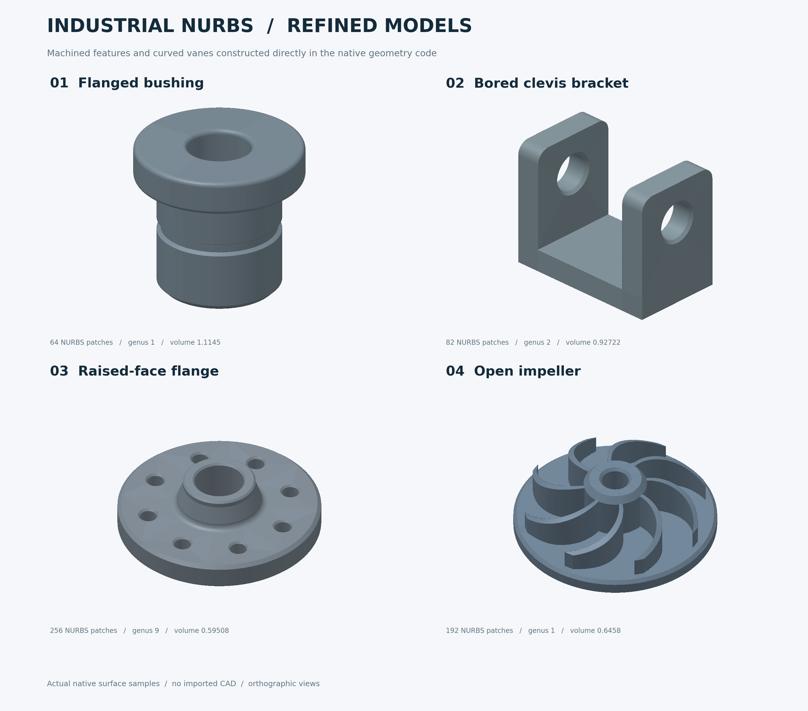

# 四个工业零件风格的原生 NURBS 算例：细化版

这四个算例在 C++ 内部直接建立控制点、权重、节点向量和面片连接。细化版增加了真实零件常见的台阶、圆孔、倒角、圆角、颈部和立体叶片。构造不读取 STEP、IGES、STL 或其他外部几何文件。它们表示封闭实体的**边界曲面**，可继续用于 KFBI 几何接口开发；本次没有运行这些域上的 PDE 求解或收敛实验。第一版展示结果保留在 `output/industrial_nurbs_v1/`。



单独查看：[轴套](previews/sleeve.png) · [支架](previews/u_bracket.png) · [法兰](previews/flange.png) · [叶轮](previews/impeller.png)。这些预览由原生 C++ 曲面求值结果生成；较大的采样 JSON 和交互 HTML 可用下文命令在本地重新生成。

每张面使用项目已有的 `kfbim::geometry3d::NurbsSurfacePatch3D`：

\[
S(u,v)=\frac{\sum_{i,j}N_{i,p}(u)N_{j,q}(v)w_{ij}P_{ij}}
{\sum_{i,j}N_{i,p}(u)N_{j,q}(v)w_{ij}},\quad (u,v)\in[0,1]^2.
\]

矩形平面采用双一次、权重为 1 的 NURBS；圆采用精确有理二次表示，带圆弧边界的平面端面采用相应有理表示。所有面片均不需要裁剪，也不使用体 NURBS、布尔运算或实体网格输入。

| 模型 | 工厂函数 | 面片数 | 次数 (u,v) | 几何特征 |
|---|---|---:|---|---|
| 带凸缘轴套 | `make_industrial_sleeve_3d()` | 64 | (2,1)、(2,2) | 凸缘、退刀槽、导入倒角、肩部及孔口圆角 |
| 双耳 U 形支架 | `make_industrial_u_bracket_3d()` | 82 | (1,1)、(2,1) | 厚底座、立式双耳、同轴圆孔、孔口倒角、耳顶圆角 |
| 八孔凸台法兰 | `make_industrial_flange_3d()` | 256 | (2,1)、(2,2) | 八个安装孔、孔口倒角、凸台颈部、密封面、根部圆角 |
| 八叶开放式叶轮 | `make_industrial_impeller_3d()` | 192 | (3,1)、(3,2) | 圆形底盘、凸起轮毂、八片后弯立体叶片、开放流道 |

叶轮的叶高从根部向外缘降低，叶片沿径向后弯，并与底盘、轮毂形成同一个实体边界；相接部位的内部面没有保留。叶片侧壁沿高度方向仍为直纹面，尚无空间扭转、翼型、叶根圆角或花键。支架没有底座安装孔和耳根圆角。法兰未加入螺纹、螺栓或密封槽。模型保留部分锐边、凹边；几何上闭合并不代表边界处处光滑，后续求解仍须正确处理这些特征。

## 尺寸与构造

尺寸采用无量纲单位，模型均位于 `[-1,1]^3` 内。参数是各工厂函数开头的常量，修改后应重新运行检查。

- 轴套：筒体半径 0.54、凸缘半径 0.74、轴孔半径 0.28，高度范围 −0.69…0.64；槽底半径 0.505；肩部圆角 R0.06、凸缘及孔口圆角 R0.04。16 段封闭母线绕轴旋转，每段分四个圆周面片；直线段给出圆柱、圆锥、环形平面，圆弧段给出精确圆环面。
- U 形支架：外尺寸 1.70 × 1.00 × 1.34，底座厚 0.24，耳板厚 0.27，耳间净距 1.16。两个沿 x 轴的贯穿孔直径 0.40，孔口直径 0.46，倒角深 0.03；耳顶圆角 R0.14。每个耳板的侧面通过六个有理面片连接圆孔和圆角外轮廓，再与底座共用边界。
- 法兰：外半径 0.90，底盘高度 −0.14…0.10；八个安装孔中心距轴 0.65，孔半径 0.075、孔口半径 0.090；中心孔半径 0.22，密封面高 0.365。中央凸台包含扩口颈部、R0.06 根部圆角、密封唇和倒角。每个安装孔周围采用无裁剪的四条有理曲面带，和旋转剖面衔接。
- 叶轮：八片叶片，底盘外半径 0.97、厚 0.16；中心孔半径 0.13、轮毂外半径 0.30、轮毂顶高 0.45；叶片半径延伸至 0.88，高度由 0.39 降至 0.18。每片占 6°，相邻流道占 39°，径向后弯 40°。三次多项式骨线与有理圆弧作复数乘积，直接得到原生张量积 NURBS。底盘、轮毂、叶片只输出暴露的外表面。

## 直接在代码中调用

```cpp
#include "src/geometry/industrial_nurbs_models_3d.hpp"

auto example = kfbim::geometry3d::make_industrial_flange_3d();
auto boundary = example.geometry_model();
auto topology = boundary.validate_closed();
const auto sample = boundary.patch(0).evaluate_with_derivatives(0.3, 0.6);
const auto outward_normal = sample.du.cross(sample.dv).normalized();
```

`geometry_model()` 返回原有的 `NurbsSurfaceModel3D`，包含完整面片和接缝关系。示例没有修改现有求解器的几何选项；若要从现有求解入口选择这些域，还需添加相应适配并验证网格交点、边界离散及 PDE 误差。

## 编译、检查和展示

可通过独立的 Eigen-only 工程生成同一套原生几何，无需为展示额外构建 CGAL 和 PDE 求解器：

```text
cmake -S examples/industrial_nurbs -B build-industrial-nurbs -DEigen3_DIR=<Eigen3Config.cmake所在目录>
cmake --build build-industrial-nurbs --config Release
ctest --test-dir build-industrial-nurbs -C Release --output-on-failure
```

在 Windows 多配置生成器中：

```powershell
& ./build-industrial-nurbs/Release/industrial_nurbs_gallery_3d.exe --samples 24
python scripts/render_industrial_nurbs.py
```

在单配置生成器中，可执行文件位于 `build-industrial-nurbs/`，配置时增加 `-DCMAKE_BUILD_TYPE=Release`。渲染脚本需要 NumPy 和 Matplotlib。标准主工程启用 `KFBIM_BUILD_3D` 时也提供 `industrial_nurbs_gallery_3d` 和 `industrial_nurbs_models_3d_test` 目标。

本机已验证的配置命令为：

```powershell
cmake -S examples/industrial_nurbs -B build-industrial-nurbs -G 'Visual Studio 15 2017 Win64' '-DEigen3_DIR=E:/Code/vs_code/KFBI-Corner/build/_deps/eigen3-build'
cmake --build build-industrial-nurbs --config Release --parallel 1
ctest --test-dir build-industrial-nurbs -C Release --output-on-failure
& ./build-industrial-nurbs/Release/industrial_nurbs_gallery_3d.exe --samples 24
& ./experiments/latest_u0906/deps/venv/Scripts/python.exe scripts/render_industrial_nurbs.py
```

`output/industrial_nurbs/models.json` 是 C++ 求值器生成的展示与检查结果，含控制网、权重、节点、接缝和采样点；它不是几何构造的输入。PNG 和 HTML 只对这些实际曲面采样点进行三角化显示，求解器中的表示仍为 NURBS。展示三角形和曲面参数网格不是 KFBI 的笛卡尔计算网格。

`overview.png` 和四张独立 PNG 已生成并检查。`interactive.html` 是包含旋转、缩放、面片接缝和采样网格开关的独立 WebGL 2 页面；嵌入的数据和 JavaScript 语法已检查，但本次自动浏览器的 URL 安全策略阻止了本地页面访问，因此其浏览器运行效果尚未验证。

## 本次实测结果

| 模型 | Euler 特征数 | 孔洞属数 | 最大接缝间隙 | 最小采样面积 Jacobian | 体积 |
|---|---:|---:|---:|---:|---:|
| 轴套 | 0 | 1 | 1.81e-16 | 0.022400 | 1.11447408690899 |
| U 形支架 | -2 | 2 | 2.22e-16 | 0.00290998 | 0.92722386295914 |
| 法兰 | -16 | 9 | 6.75e-16 | 0.00173621 | 0.59507822567831 |
| 叶轮 | 0 | 1 | 7.02e-16 | 0.000481092 | 0.64580249552616 |

检查包括：原生 `validate_closed()`；每条边恰有一个配对且接缝方向一致；边界连接图只有一个连通分量；Euler 特征数正确；每张面在包含边界的 41×41 参数点上的 Jacobian 非零；任意朝向的平面端面方向不翻转；65 点接缝检查；正向体积和闭曲面的积分法向通量；16/24 阶 Gauss 体积积分一致性。轴套、法兰使用旋转母线的解析积分，支架使用圆角轮廓面积与圆柱/圆台孔容积，叶轮使用底盘、轮毂和多项式叶片高度的独立解析积分。四者体积相对误差均小于 3.2e-14。

叶轮工厂另外检查径向骨线 `R·R'` 的 Bernstein 系数为正，保证其半径随参数严格递增；8 个角向分区因此不交叉。回归测试直接检查凸缘高度差、双耳贯穿孔拓扑、八孔法兰拓扑、凸台高度，以及叶轮八片叶片的 16 个弯曲侧面，防止退回第一版的简陋几何。

负向测试确认：移除一条接缝或反转一张面片会被拒绝。有限采样检查不构成任意参数下的全局自交证明；更改控制点/尺寸后必须重新核验。以上仅为几何构造与验证结果，不是 KFBI 在这些零件上的收敛性或工业应用成熟度结论。

外形参考仍为此前讨论的 [7Tiger 轴套](https://www.7tmw.com/product/77-standard-steel-bushings)、[Anebon U 形零件](https://www.anebon.com/sk/aluminum-for-cnc-milling.html)、[Valvula 法兰](https://www.bdvalvula.com/carbon-steel-plate-flange-rf-gost-12820.html) 和 [Forge Labs 叶轮](https://forgelabs.com/3d-printing/materials/stainless-steel-17-4ph)。模型尺寸和新增细节是为本项目设计的算例参数，不是对照片尺寸的测量或对应产品标准的复刻。
